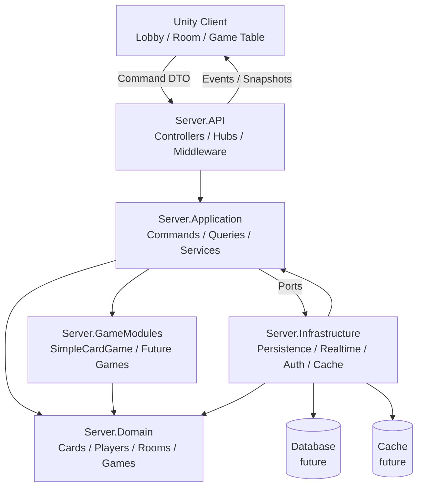
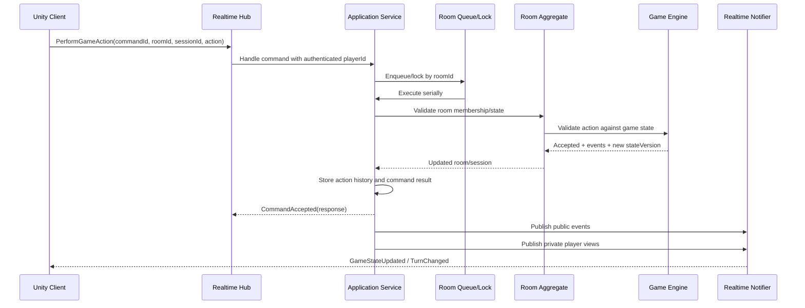
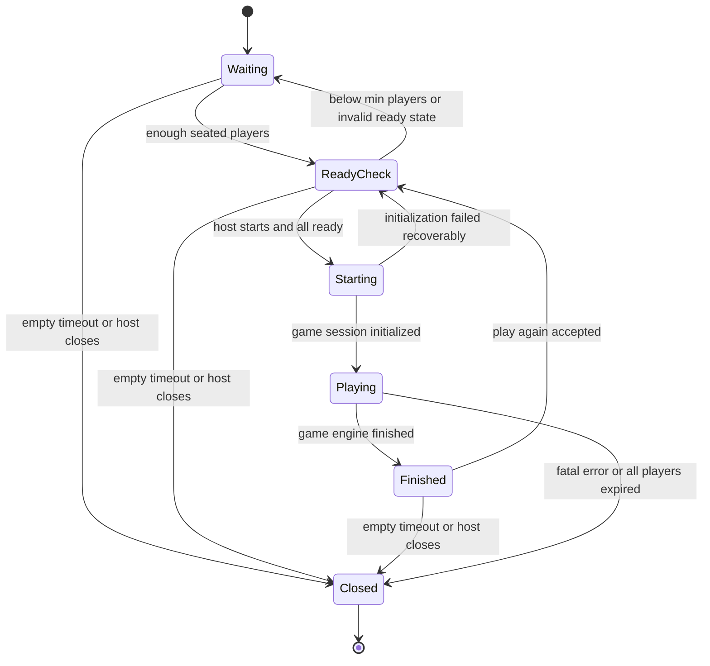
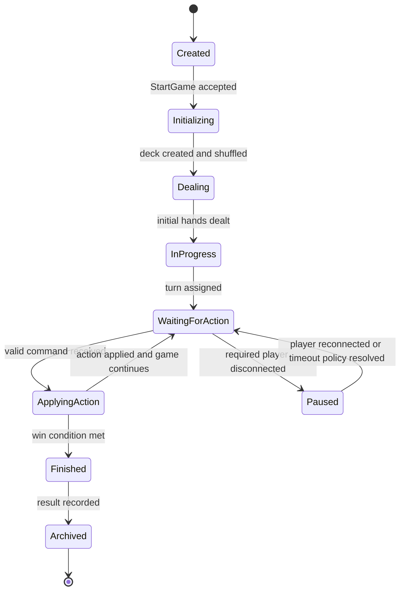

# Architecture

## Kiến Trúc Tổng Thể

Repository hiện tại là Unity project mới, chưa có backend. Kiến trúc đề xuất sau khi được duyệt là modular monolith với Unity client và ASP.NET Core authoritative server.

Các module chính:

- `Client.Unity`: Unity UI, input, realtime client, state rendering.
- `Server.API`: HTTP endpoints, SignalR hubs, middleware, authentication adapter.
- `Server.Application`: command/query handlers, orchestration, DTO mapping, validation cấp ứng dụng.
- `Server.Domain`: card, player, room, game engine abstractions, domain rules thuần C#.
- `Server.GameModules`: các game cụ thể như sample High Card, Tiến Lên, Phỏm trong tương lai.
- `Server.Infrastructure`: persistence, cache, realtime adapter, clock/random implementation, external services.
- `Server.Tests`: unit/integration tests.

Trong giai đoạn spec này không tạo các project/code trên. Đây là cấu trúc định hướng cho phase implement.

## Trách Nhiệm Từng Layer/Module

`Client.Unity`:

- Hiển thị guest/login entry, lobby, waiting room, game table.
- Gửi command lên server.
- Nhận event/snapshot và render UI.
- Không quyết định shuffle, deal, valid move, winner hoặc score.

`Server.API`:

- Nhận HTTP/realtime requests.
- Xác thực connection/player.
- Chuyển payload thành application command.
- Gửi response/event về client.
- Không chứa luật game.

`Server.Application`:

- Điều phối use case: create room, join room, ready, start game, perform action, reconnect.
- Kiểm tra authorization cấp room.
- Gọi domain service/game engine.
- Quản lý idempotency, state version và transaction boundary in-memory.
- Mapping domain event thành realtime DTO.

`Server.Domain`:

- Entity/value object/domain service thuần.
- Room aggregate và state machine.
- Card model 52 lá.
- Game session và game engine contract.
- Không phụ thuộc ASP.NET Core, SignalR, Unity, database hoặc serialization framework.

`Server.GameModules`:

- Luật từng game cụ thể.
- Game definition, action types, state type, comparer/win condition riêng.
- Phụ thuộc domain abstractions, không phụ thuộc API/UI.

`Server.Infrastructure`:

- Repository/cache implementation.
- SignalR broadcaster implementation.
- Random/shuffle implementation.
- Authentication/reconnect token store.
- Database implementation sau này.

## Dependency Direction

Quy tắc hướng phụ thuộc:

- `Client.Unity` phụ thuộc realtime contract DTO, không phụ thuộc domain internals.
- `Server.API` phụ thuộc `Server.Application`.
- `Server.Application` phụ thuộc `Server.Domain` abstractions và interface ports.
- `Server.GameModules` phụ thuộc `Server.Domain`.
- `Server.Infrastructure` phụ thuộc `Server.Application` ports và `Server.Domain` để implement adapter.
- `Server.Domain` không phụ thuộc layer nào khác.

Dependency inversion:

- Application định nghĩa port như `IRoomRepository`, `IRealtimeNotifier`, `IPlayerConnectionRegistry`, `IClock`, `IRandomSource`.
- Infrastructure implement các port đó.
- Game engine nhận dependency cần thiết qua constructor/factory, không gọi trực tiếp static/global services.

## Module Reference Rules

Allowed:

- API -> Application.
- Application -> Domain.
- Application -> GameModules qua registry/definition abstraction.
- Infrastructure -> Application + Domain.
- GameModules -> Domain.
- Tests -> mọi module cần test.

Not allowed:

- Domain -> API/Infrastructure/Unity/SignalR/EF Core.
- GameModules -> API/SignalR/Unity.
- Controllers/Hubs -> concrete game rule classes trực tiếp.
- Unity UI -> tự mutate authoritative state.
- Infrastructure persistence -> gọi ngược UI/API.

## Phần Không Được Phụ Thuộc Framework

Các phần sau phải là pure C# và không phụ thuộc Unity/ASP.NET Core/SignalR/EF Core:

- `Card`, `Deck`, `Hand`.
- `Room`, `Seat`, `RoomState`.
- `GameSession`, `GameAction`, `GameEvent`.
- Game engine và sample game rules.
- Turn manager/win condition/card comparer.
- Domain validators và state transitions.

## Luồng Xử Lý Từ Frontend Đến Game Engine

1. Unity UI tạo command DTO với `commandId`.
2. Realtime client gửi command qua SignalR/WebSocket.
3. Hub nhận command, xác thực connection.
4. Application handler kiểm tra player/room/session.
5. Per-room queue hoặc lock serialize command.
6. Room aggregate kiểm tra state room.
7. Game engine validate/apply game action.
8. Domain trả events, stateVersion mới, player views.
9. Application lưu action history/dedupe result.
10. API trả response cho requester và broadcast events.
11. Unity client render state mới.

## Luồng Broadcast Event Về Frontend

1. Domain/game engine sinh `IGameEvent` hoặc `RoomEvent`.
2. Application mapping sang realtime event DTO.
3. Public event gửi cho SignalR group của room.
4. Private update gửi riêng từng connection/player.
5. Client cập nhật local view theo `stateVersion`.
6. Nếu client phát hiện thiếu version, gửi `RequestStateSync`.

## Mermaid Diagram Cho Kiến Trúc

## Mermaid Sequence Diagram Cho Một Lượt Chơi

## Mermaid State Diagram Cho Room

## Mermaid State Diagram Cho Game Session

## Kiến Trúc Game Module

Mỗi game module nên cung cấp:

- `GameDefinition`: id, display name, min/max player, supported action types.
- `GameState`: state riêng của game.
- `GameEngine`: initialize, validate, apply action, create views.
- Optional services: `CardComparer`, `WinCondition`, `ScoreCalculator`, `TurnManager`.

Game mới được đăng ký vào `GameDefinitionRegistry`. Application chỉ chọn game qua `gameType`, không switch/case rải rác trong Hub/Controller.

## Assumptions

- Backend sẽ được thêm mới, chưa tồn tại trong repository.
- Unity là frontend đầu tiên; web frontend chưa nằm trong scope.
- Giai đoạn đầu chạy một server process, in-memory active room/session.
- Database chỉ cần thiết khi bắt đầu lưu user/result/history lâu dài.
- SignalR là realtime transport đề xuất nếu dùng ASP.NET Core.
